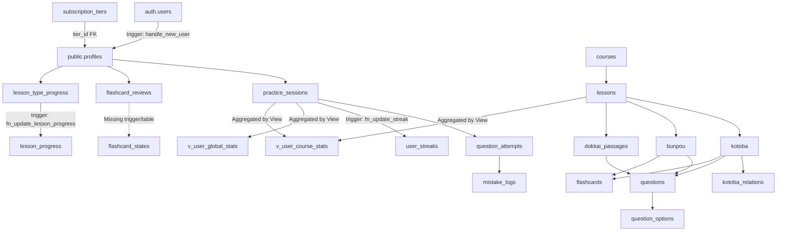
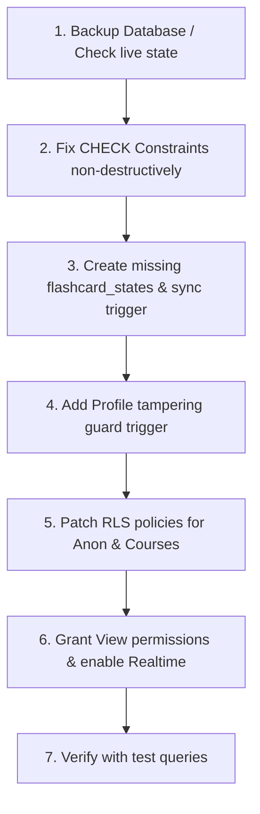

# Database and Architecture Audit

**Project:** JLPT Japanese Learning Web Application (Nihongo Tokkun)  
**Date:** September 2026  
**Status:** Audit & Security Analysis (Pre-implementation)

---

## 1. Existing Architecture

The application is structured around a Supabase backend (PostgreSQL + Auth + Realtime) with direct client-side querying via the Supabase JavaScript Client. Content is structured hierarchically across JLPT levels (N5–N1) with three primary categories per course: **語彙 (Kotoba)**, **文法 (Bunpou)**, and **読解 (Dokkai)**.

### Existing SQL Scripts Inspected
1. `supabase/schema (1).sql` (Core Schema: 15 base tables + helper functions + core RLS)
2. `supabase/migration_additional_features.sql` (Feature Extension: 6 tables + guest access + progress triggers + views)
3. `supabase/handle_new_user_trigger.sql` (Auth Hook: `auth.users` -> `public.profiles` auto-provisioning)

### High-Level Entity Relationship & Data Flow


---

## 2. PRD Requirements

| Area | Requirement Summary |
|---|---|
| **Access Levels** | 4 distinct tiers: `Guest` (unauthenticated, `number=1` only), `Free` (authenticated, all lessons), `Premium` (subscription placeholder), `Admin` (full CMS + content CRUD). |
| **Guest Scope** | Read access to courses, guest-accessible lessons (`is_guest_accessible = true`), related content, and aggregated leaderboard. No persistent progress saved. |
| **Lesson Progression** | Unit marked `completed` only when **all** active `question_type`s in the unit achieve $\ge 90\%$ (`app_config.passing_grade_percent`). If one fails, application resets all unit types. |
| **Practice & Mistakes** | Multiple choice questions (4 options). Attempts recorded with response time. Incorrect answers log preset/custom reasons into `mistake_logs`. |
| **Flashcard / SRS** | Unit cards reviewed with 2-scale rating (`Again` / `Good`). Reviews logged in `flashcard_reviews` and synced to `flashcard_states` snapshot. |
| **Leaderboard** | Global and per-course leaderboard aggregating `total_correct`, `accuracy_percent`, and `total_time_seconds`. Must NOT expose individual attempt details. |
| **Admin Realtime CMS** | Collaborative content editing with lock indicators via `edit_locks` and Supabase Realtime publication. |
| **Data Integrity** | Strict RLS on every table. Protection against privilege escalation (`role`, `tier_id`). Idempotent bulk import via `legacy_id`. |

---

## 3. Schema vs PRD Differences

| Area / Feature | PRD Specification | Existing SQL Schema Status | Severity |
|---|---|---|:---:|
| **Courses Guest Visibility** | Guests must view the course list to browse levels on landing page. | `courses` has only `courses_select_authenticated`. `anon` role is blocked. | **CRITICAL** |
| **Flashcard Current State** | PRD references `flashcard_states` table and `sync_flashcard_state` trigger. | `flashcard_states` table and its trigger are **completely missing** from all SQL files. | **CRITICAL** |
| **Profiles Privilege Control** | Regular users cannot elevate their role to `admin` or change `tier_id`. | `profiles_update_own_or_admin` allows authenticated users to update ANY column on their row. | **CRITICAL** |
| **Leaderboard Profiles Join** | Leaderboard displays user name/username alongside aggregated scores. | `profiles` RLS only allows selecting own profile (`id = auth.uid()`). Leaderboard cannot display usernames. | **HIGH** |
| **Leaderboard Guest Access** | Guests can view the public leaderboard view. | `v_user_global_stats` and `v_user_course_stats` only granted to `authenticated`. `anon` blocked. | **HIGH** |
| **Kotoba Relations Enum** | Relation types: `'related_kanji'`, `'synonym'`, `'antonym'`, `'confusable'`, `'other'`. | Conflicting CHECK constraints between base schema and migration script. | **HIGH** |
| **Kotoba Relations Guest Access** | Guests should view related kanji/words in public lessons. | `kotoba_relations` has no `anon` SELECT policy. | **MEDIUM** |
| **Realtime Publication** | `edit_locks` table broadcasted via Supabase Realtime for CMS indicators. | Missing `ALTER PUBLICATION supabase_realtime ADD TABLE edit_locks;`. | **MEDIUM** |
| **Search Path Security** | Database functions with `SECURITY DEFINER` must set explicit `search_path`. | `fn_update_lesson_progress` and `fn_update_streak` omit `SET search_path = public`. | **HIGH** |
| **Profile Avatar Field** | PRD mentions avatar/display support for leaderboard & topbar. | `profiles` table only has `id`, `username`, `role`, `tier_id`, `created_at`, `updated_at`. No `avatar_url` or `display_name`. | **LOW** |

---

## 4. Security Issues

```
┌──────────────────────────────────────────────────────────────────────────┐
│                             SECURITY AUDIT                               │
├──────────┬───────────────────────────────────────────────────────────────┤
│ CRITICAL │ 1. Privilege Escalation via profiles update RLS               │
│ CRITICAL │ 2. Anonymous users completely blocked from courses table      │
│ HIGH     │ 3. SECURITY DEFINER search_path hijacking in triggers         │
│ HIGH     │ 4. Leaderboard username enumeration / privacy boundary issue   │
│ HIGH     │ 5. Conflicting CHECK constraint breaking kotoba_relations     │
│ MEDIUM   │ 6. Missing anon RLS policies on kotoba_relations              │
└──────────┴───────────────────────────────────────────────────────────────┘
```

### Issue 1: Privilege Escalation via `profiles` Update Policy (CRITICAL)
* **Location:** `supabase/schema (1).sql:439-442`
```sql
create policy profiles_update_own_or_admin on public.profiles
for update to authenticated
using (id = auth.uid() or public.is_admin())
with check (id = auth.uid() or public.is_admin());
```
* **Vulnerability:** Any authenticated user can issue a client-side update:
```javascript
supabase.from('profiles').update({ role: 'admin', tier_id: '...' }).eq('id', user.id);
```
Since `with check (id = auth.uid())` is satisfied, the database accepts the update. The user immediately gains `is_admin() = true`, allowing full CMS access and content manipulation.
* **Remediation:** Implement a `BEFORE UPDATE` trigger on `public.profiles` that forces `NEW.role := OLD.role` and `NEW.tier_id := OLD.tier_id` when the executing user is not an administrator, or strictly restrict modifiable columns.

---

### Issue 2: Anonymous Users Blocked from `courses` Table (CRITICAL)
* **Location:** `supabase/schema (1).sql:389-390`
```sql
create policy courses_select_authenticated on public.courses
for select to authenticated using (true);
```
* **Vulnerability:** No SELECT policy exists for the `anon` role on `courses`. When a guest visits the landing page, `supabase.from('courses').select('*')` returns an empty array or an RLS permission error.
* **Remediation:** Add policy:
```sql
create policy courses_select_all on public.courses
for select to authenticated, anon using (true);
```

---

### Issue 3: Insecure `search_path` on `SECURITY DEFINER` Triggers (HIGH)
* **Location:** `supabase/migration_additional_features.sql:183-214`, `327-365`
* **Vulnerability:** Functions `fn_update_lesson_progress()` and `fn_update_streak()` are declared `SECURITY DEFINER` but do not specify `SET search_path = public, pg_temp`. An attacker who creates malicious objects in a temporary schema or manipulates search paths could trigger privilege escalation under the definer's role.
* **Remediation:** Add `SET search_path = public, pg_temp` to both function definitions.

---

### Issue 4: Leaderboard User Identification Failure (HIGH)
* **Location:** `supabase/schema (1).sql:435-437`, `supabase/migration_additional_features.sql:416-417`
* **Vulnerability:** `v_user_global_stats` and `v_user_course_stats` output `user_id`. To display usernames on the leaderboard, the frontend must query `profiles`. However, `profiles` RLS policy `profiles_select_own_or_admin` strictly restricts reads to `id = auth.uid()`. Non-admin users cannot see other users' usernames on the leaderboard.
* **Remediation:** Create a secure public view or function `v_leaderboard_global` / `v_leaderboard_course` that pre-joins `profiles.username` (and `avatar_url`) with aggregated statistics, or adjust `profiles` SELECT policy to permit reading public profile fields (`id`, `username`) while protecting sensitive columns.

---

### Issue 5: Missing Guest Leaderboard Grant (HIGH)
* **Location:** `supabase/migration_additional_features.sql:416-417`
```sql
grant select on v_user_global_stats to authenticated;
grant select on v_user_course_stats to authenticated;
```
* **Vulnerability:** PRD Section 14 explicitly specifies that guests can view the leaderboard in read-only mode. However, `anon` is not granted `SELECT` on these views.
* **Remediation:** Grant SELECT on views to both `authenticated` and `anon`.

---

## 5. Missing Database Objects

The following objects are explicitly required by the PRD or necessary for architectural integrity but are absent from the SQL files:

### 1. `public.flashcard_states` (CRITICAL)
PRD Sections 4, 9, 11, and 17 require a per-user flashcard snapshot table.
```sql
create table if not exists public.flashcard_states (
  id uuid primary key default gen_random_uuid(),
  user_id uuid not null references auth.users(id) on delete cascade,
  flashcard_id uuid not null references public.flashcards(id) on delete cascade,
  box int4 not null default 1,
  interval_days int4 not null default 1,
  ease_factor numeric(4,2) not null default 2.50,
  consecutive_correct int4 not null default 0,
  last_rating text check (lower(last_rating) in ('again','hard','good','easy')),
  last_reviewed_at timestamptz not null default now(),
  next_review_at timestamptz not null default now(),
  created_at timestamptz not null default now(),
  updated_at timestamptz not null default now(),
  unique(user_id, flashcard_id)
);
```

### 2. `public.sync_flashcard_state()` Trigger Function (CRITICAL)
PRD lines 65, 91, 237 specify an automatic sync trigger from `flashcard_reviews` to `flashcard_states`.
```sql
create or replace function public.sync_flashcard_state()
returns trigger
language plpgsql
security definer
set search_path = public, pg_temp
as $$
begin
  insert into public.flashcard_states (
    user_id,
    flashcard_id,
    last_rating,
    last_reviewed_at,
    next_review_at,
    consecutive_correct,
    updated_at
  )
  values (
    new.user_id,
    new.flashcard_id,
    new.rating,
    new.reviewed_at,
    coalesce(new.next_review_at, now() + interval '1 day'),
    case when new.rating in ('good', 'easy') then 1 else 0 end,
    now()
  )
  on conflict (user_id, flashcard_id) do update
    set last_rating = excluded.last_rating,
        last_reviewed_at = excluded.last_reviewed_at,
        next_review_at = excluded.next_review_at,
        consecutive_correct = case 
          when excluded.last_rating in ('good', 'easy') then flashcard_states.consecutive_correct + 1
          else 0
        end,
        updated_at = now();
  return new;
end;
$$;

drop trigger if exists trg_flashcard_reviews_sync on public.flashcard_reviews;
create trigger trg_flashcard_reviews_sync
after insert on public.flashcard_reviews
for each row execute function public.sync_flashcard_state();
```

### 3. Supabase Realtime Publication for `edit_locks` (MEDIUM)
```sql
alter publication supabase_realtime add table public.edit_locks;
```

---

## 6. Conflicting Database Objects

### 1. `kotoba_relations` CHECK Constraint Mismatch (HIGH)
* **In `schema (1).sql:75-77`:**
  Constraint generated anonymously on column `relation_type`:
  `check (lower(relation_type) in ('synonym','antonym','similar','usage_difference','related'))`
  PostgreSQL automatically names this: `kotoba_relations_relation_type_check`.
* **In `migration_additional_features.sql:293-296`:**
  ```sql
  alter table kotoba_relations drop constraint if exists kotoba_relations_type_check;
  alter table kotoba_relations
    add constraint kotoba_relations_type_check
    check (relation_type in ('related_kanji', 'synonym', 'antonym', 'confusable', 'other'));
  ```
* **Conflict:** The drop statement targets `kotoba_relations_type_check` (which does not exist yet). The original `kotoba_relations_relation_type_check` remains active.
* **Consequence:** Any attempt to insert relations with `'related_kanji'`, `'confusable'`, or `'other'` fails with a CHECK constraint violation because only `'synonym'` and `'antonym'` intersect both lists.
* **Fix:** Drop the exact constraint name `kotoba_relations_relation_type_check` before adding the new constraint.

### 2. Idempotency and Duplicate Policy Execution (MEDIUM)
* `schema (1).sql` uses a dynamic DO block to drop policies on 15 core tables.
* `migration_additional_features.sql` uses direct `create policy` without `drop policy if exists`. Re-running the migration throws `ERROR: policy "..." already exists`.

---

## 7. Comprehensive RLS Matrix

| Table | Anonymous (`anon` / Guest) | Authenticated (`authenticated` / Free / Premium) | Admin (`is_admin() = true`) | Notes & Deficiencies |
|---|:---:|:---:|:---:|---|
| `courses` | ❌ **Blocked** | SELECT (All) | SELECT, INSERT, UPDATE, DELETE | **Fix required:** Grant SELECT to `anon`. |
| `lessons` | SELECT (`is_guest_accessible = true`) | SELECT (All) | SELECT, INSERT, UPDATE, DELETE | Correct. |
| `kotoba` | SELECT (via guest lesson) | SELECT (`is_active = true`) | All | Correct. |
| `kotoba_relations` | ❌ **Blocked** | SELECT (All) | All | **Fix required:** Grant SELECT to `anon`. |
| `bunpou` | SELECT (via guest lesson) | SELECT (`is_active = true`) | All | Correct. |
| `dokkai_passages` | SELECT (via guest lesson) | SELECT (`is_active = true`) | All | Correct. |
| `questions` | SELECT (via guest lesson) | SELECT (`is_active = true`) | All | Correct. |
| `question_options` | SELECT (via guest lesson) | SELECT (All) | All | Correct. |
| `flashcards` | SELECT (via guest lesson) | SELECT (`is_active = true`) | All | Correct. |
| `profiles` | ❌ Blocked | SELECT (Own), UPDATE (Own) | All | **Critical fix:** Block `role`/`tier_id` tampering; permit username lookup for leaderboard. |
| `practice_sessions` | ❌ Blocked | SELECT, INSERT, UPDATE (Own) | All | Correct. |
| `question_attempts` | ❌ Blocked | SELECT, INSERT, UPDATE (Own) | All | Correct. |
| `mistake_logs` | ❌ Blocked | SELECT, INSERT, UPDATE (Own) | All | Correct. |
| `flashcard_reviews` | ❌ Blocked | SELECT, INSERT, UPDATE (Own) | All | Correct. |
| `flashcard_states` | ❌ Blocked | SELECT, INSERT, UPDATE (Own) | All | **Table missing;** RLS must be added. |
| `edit_locks` | ❌ Blocked | SELECT, INSERT, UPDATE, DELETE (Own) | All | Correct. |
| `subscription_tiers`| SELECT (`is_active = true`) | SELECT (`is_active = true`) | All | Correct. |
| `lesson_progress` | ❌ Blocked | SELECT, INSERT, UPDATE (Own) | All | Correct. |
| `lesson_type_progress`| ❌ Blocked | SELECT, INSERT, UPDATE (Own) | All | Correct. |
| `app_config` | SELECT (All) | SELECT (All) | All | Correct. |
| `mistake_reason_presets`| ❌ Blocked | SELECT (`is_active = true`) | All | Correct. |
| `user_streaks` | ❌ Blocked | SELECT, INSERT, UPDATE (Own) | All | Correct. |
| `v_user_global_stats`| ❌ **Blocked** | SELECT | SELECT | **Fix required:** Grant SELECT to `anon`. |
| `v_user_course_stats`| ❌ **Blocked** | SELECT | SELECT | **Fix required:** Grant SELECT to `anon`. |

---

## 8. Recommended Fixes

### Fix 1: Prevent Profile Privilege Escalation (CRITICAL)
Create an immutable guard trigger on `profiles`:
```sql
create or replace function public.protect_profile_fields()
returns trigger
language plpgsql
security definer
set search_path = public, pg_temp
as $$
begin
  if not public.is_admin() then
    -- Regular users cannot alter their role or tier
    new.role := old.role;
    new.tier_id := old.tier_id;
  end if;
  return new;
end;
$$;

drop trigger if exists trg_protect_profile_fields on public.profiles;
create trigger trg_protect_profile_fields
before update on public.profiles
for each row execute function public.protect_profile_fields();
```

### Fix 2: Enable Guest Access on Courses & Kotoba Relations (CRITICAL / MEDIUM)
```sql
drop policy if exists courses_select_all on public.courses;
drop policy if exists courses_select_authenticated on public.courses;
create policy courses_select_all on public.courses
for select to authenticated, anon using (true);

drop policy if exists kotoba_relations_select_anon on public.kotoba_relations;
create policy kotoba_relations_select_anon on public.kotoba_relations
for select to anon using (
  exists (
    select 1 from public.kotoba k
    join public.lessons l on l.id = k.lesson_id
    where (k.id = kotoba_relations.kotoba_id or k.id = kotoba_relations.related_kotoba_id)
      and l.is_guest_accessible = true
  )
);
```

### Fix 3: Fix `kotoba_relations` CHECK Constraint (HIGH)
```sql
alter table public.kotoba_relations drop constraint if exists kotoba_relations_relation_type_check;
alter table public.kotoba_relations drop constraint if exists kotoba_relations_type_check;
alter table public.kotoba_relations
  add constraint kotoba_relations_type_check
  check (relation_type in ('related_kanji', 'synonym', 'antonym', 'confusable', 'other'));
```

### Fix 4: Create Missing `flashcard_states` & Sync Trigger (CRITICAL)
Create the table, indexes, RLS policies, and sync trigger as detailed in Section 5.

### Fix 5: Secure Leaderboard Views & Permissions (HIGH)
```sql
grant select on public.v_user_global_stats to anon;
grant select on public.v_user_course_stats to anon;

-- Policy to allow authenticated and anon users to read basic profile information for leaderboard display
drop policy if exists profiles_select_public on public.profiles;
create policy profiles_select_public on public.profiles
for select to authenticated, anon
using (true);
```
*(Note: If email or private data is ever stored in profiles, use a dedicated view `v_public_profiles` or column-level permissions. Currently, `profiles` contains only `id`, `username`, `role`, `tier_id`).*

### Fix 6: Secure Triggers with `search_path` (HIGH)
Update `fn_update_lesson_progress` and `fn_update_streak` to include `set search_path = public, pg_temp`.

### Fix 7: Fix `fn_update_streak` Null Handling (MEDIUM)
Ensure `fn_update_streak` handles rows where `last_active_date` is currently `NULL`:
```sql
create or replace function public.fn_update_streak()
returns trigger
language plpgsql
security definer
set search_path = public, pg_temp
as $$
declare
  last_date date;
  today date := (new.completed_at at time zone 'Asia/Jakarta')::date;
begin
  if new.completed_at is null then
    return new;
  end if;

  select last_active_date into last_date from public.user_streaks where user_id = new.user_id;

  if not found then
    insert into public.user_streaks (user_id, current_streak, longest_streak, last_active_date, updated_at)
    values (new.user_id, 1, 1, today, now())
    on conflict (user_id) do update
      set current_streak = 1,
          longest_streak = greatest(user_streaks.longest_streak, 1),
          last_active_date = today,
          updated_at = now();
  elsif last_date is null or last_date < today - 1 then
    update public.user_streaks
    set current_streak = 1,
        longest_streak = greatest(longest_streak, 1),
        last_active_date = today,
        updated_at = now()
    where user_id = new.user_id;
  elsif last_date = today - 1 then
    update public.user_streaks
    set current_streak = current_streak + 1,
        longest_streak = greatest(longest_streak, current_streak + 1),
        last_active_date = today,
        updated_at = now()
    where user_id = new.user_id;
  elsif last_date = today then
    null; -- already recorded for today
  end if;

  return new;
end;
$$;
```

---

## 9. Safe Migration Plan

Because the production/staging database already contains existing data imported from spreadsheets, any migration must be strictly additive and non-destructive.



### Phase 1: Pre-flight Verification Queries
Run non-modifying inspection queries:
1. Verify existing constraints on `kotoba_relations`:
   `select conname, pg_get_constraintdef(oid) from pg_constraint where conrelid = 'public.kotoba_relations'::regclass;`
2. Verify existing columns on `profiles` and `lessons`.
3. Check existing triggers on `auth.users` and `practice_sessions`.

### Phase 2: Schema Alignments (DDL)
1. Add `flashcard_states` table with `IF NOT EXISTS`.
2. Re-align `kotoba_relations` constraint safely.
3. Update `SECURITY DEFINER` functions with fixed `search_path` and null checks.

### Phase 3: RLS & Policy Consolidation
1. Execute idempotent RLS policy drops and recreation.
2. Add `protect_profile_fields` trigger.
3. Add guest policies for `courses`, `kotoba_relations`, and views.

### Phase 4: Realtime Configuration
1. Ensure `supabase_realtime` publication includes `edit_locks`.

---

## 10. Things That Must NOT Be Changed

To prevent data corruption, regression, or breaking existing imported content:

1. **Do NOT Drop or Rename Existing Primary / Foreign Keys:**
   All `legacy_id` columns, `id` UUIDs, and foreign key cascades (`on delete cascade`) must remain intact to preserve spreadsheet import idempotency.
2. **Do NOT Modify the Meaning of `is_supplementary`:**
   In `kotoba` and `bunpou`, `is_supplementary = false` represents mandatory curriculum units, while `true` represents optional user findings.
3. **Do NOT Hardcode Passing Grade in Database Triggers:**
   The `passing_grade_percent` (90%) must continue to be read dynamically from `app_config` by client logic as specified in PRD Section 2.
4. **Do NOT Move Reset Logic into Database Triggers:**
   The PRD explicitly mandates that resetting all question types in a unit when one fails is handled by client/application workflow, NOT by database triggers, ensuring business logic transparency.
5. **Do NOT Store Plaintext Passwords or Custom Tokens in `profiles`:**
   Authentication remains strictly managed by `auth.users` via Supabase Auth.
6. **Do NOT Filter Due Dates in Lesson Flashcard Queries:**
   In lesson flashcard sessions, all cards for the lesson must appear regardless of `next_review_at` (Anki-style review mode as defined in PRD Section 9).
7. **Do NOT Duplicate `kotoba_relations` Rows:**
   Queries must remain bidirectional using `kotoba_id = :id OR related_kotoba_id = :id` without storing reverse row pairs.
