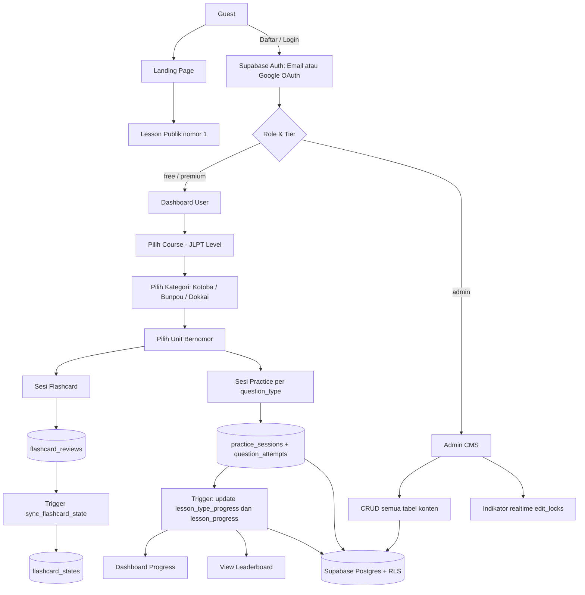
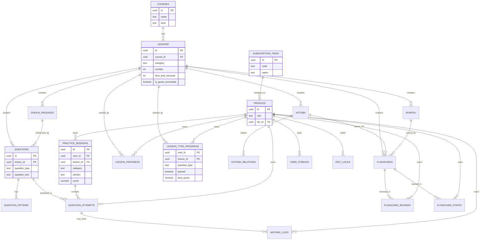

# PRD — Aplikasi Belajar Bahasa Jepang Berbasis JLPT

**Status dokumen:** Draft final dari sesi requirement gathering. Dokumen ini dibuat untuk diteruskan ke tim/AI developer lain sebagai acuan implementasi. Backend (Supabase/Postgres) sudah ada dan sebagian sudah dimigrasikan dari data spreadsheet lama.

---

## 1. Ringkasan Produk

Aplikasi web untuk latihan bahasa Jepang terstruktur mengikuti level JLPT (N5–N1). Konten dibagi 3 kategori besar per course: **語彙 (Kotoba/Kosakata)**, **文法 (Bunpou/Tata Bahasa)**, **読解 (Dokkai/Membaca)**. Tiap kategori dipecah jadi unit bernomor (Kotoba 1, Kotoba 2, dst), dan tiap unit punya beberapa tipe latihan (multiple choice) + 1 set flashcard.

Target pengalaman: **playful, seperti game, nyaman dimainkan jangka panjang** — bukan tampilan akademik yang kaku.

Masalah yang diselesaikan:
- Materi belajar JLPT sebelumnya tersebar di spreadsheet, sulit dipakai untuk latihan interaktif dan tidak melacak progress user.
- Tidak ada cara sistematis untuk tahu kategori/tipe soal mana yang paling sering salah per user.
- Latihan flashcard manual (spreadsheet/kertas) tidak mendukung spaced repetition.

---

## 2. Requirements (Aturan Sistem Wajib)

Daftar aturan level-sistem yang harus dipenuhi implementasi, terlepas dari detail UI:

- Sistem harus mendukung **4 tingkat akses**: guest (tanpa akun), free, premium, admin — lihat Bagian 6.
- Guest **hanya** boleh mengakses lesson dengan `is_guest_accessible = true`; progress guest **tidak** tersimpan permanen.
- Registrasi/login harus mendukung **email+password** dan **Google OAuth**, keduanya lewat Supabase Auth langsung (bukan implementasi custom).
- **Row Level Security (RLS) wajib aktif di semua tabel** tanpa kecuali — user tidak boleh bisa membaca/mengubah data user lain lewat client langsung.
- Sebuah unit lesson (misal "Kotoba 3") dianggap **completed** hanya jika **semua** `question_type` di unit itu mencapai skor ≥ `passing_grade_percent` (default 90%, dikonfigurasi lewat `app_config`, bukan hardcode).
- Jika salah satu `question_type` gagal (<90%), **seluruh** `question_type` di unit itu harus diulang — bukan cuma yang gagal.
- Setiap jawaban (benar/salah) harus tercatat di `question_attempts` untuk keperluan analitik dan mistake log.
- Leaderboard **tidak boleh** membocorkan data attempt/jawaban individu user lain — hanya angka agregat (skor total, persentase, waktu belajar) yang boleh terlihat lintas user.
- Timer sesi (bukan per soal) bersifat **opsional per lesson**, diatur admin lewat `lessons.time_limit_seconds` (NULL = tanpa batas).
- Admin harus bisa mengelola **seluruh tabel konten** (course, lesson, kotoba, bunpou, dokkai, questions, flashcards, dst) lewat UI CMS di aplikasi — tanpa perlu buka Supabase Dashboard langsung.
- Saat 2 admin mengedit konten yang sama bersamaan, harus ada **indikator realtime** ("sedang diedit oleh...") berbasis tabel `edit_locks`.
- MVP **tidak** memerlukan payment gateway otomatis (karena tier Premium belum punya fitur eksklusif berbayar — lihat Bagian 15).
- MVP **tidak** memerlukan dukungan offline.

---

## 3. Tech Stack

| Layer | Pilihan | Catatan |
|---|---|---|
| Framework | **Next.js (App Router)** | SSR untuk landing/guest page, mudah deploy ke Vercel |
| Backend | **Supabase** (Postgres + Auth + Realtime) | Sudah ada, lihat Bagian 13 |
| Data fetching | **Supabase JS client langsung** | Tanpa layer API custom, tanpa React Query/SWR di MVP |
| Styling | **Tailwind CSS** | Lihat design system Bagian 12 |
| Font | `Inter` / `Plus Jakarta Sans` (UI), `Noto Sans JP` (teks Jepang, wajib untuk kejelasan kanji) | |
| Auth | **Supabase Auth** — Email/Password + Google OAuth | Dikirim langsung oleh Supabase, tidak custom |
| Hosting | **Vercel**, deploy dari repo GitHub | |
| Bahasa UI | **Bahasa Indonesia** | Istilah Jepang (語彙, 文法, dst) tetap ditampilkan sebagai label kategori |
| Mode tampilan | **Light & Dark mode** dengan toggle switch | Default: dark (sesuai referensi desain) |
| Responsif | **Sidebar kiri di desktop, bottom-nav di mobile** | Lihat Bagian 12.5 |
| Offline support | Tidak diperlukan | |

---

## 4. Architecture

Komponen utama sistem:

- **Public Web** — landing page + halaman lesson guest (`number=1` per course), diakses tanpa login.
- **Auth Layer** — Supabase Auth (email/password + Google OAuth), menghasilkan `auth.users` + trigger `handle_new_user()` yang otomatis membuat row `profiles` (role default `user`, tier default `free`).
- **Practice Engine** — logic sesi latihan: ambil soal per `question_type`, timer sesi, scoring, pass/fail, reset-semua-tipe-jika-gagal (Bagian 8).
- **Flashcard/SRS Engine** — sesi flashcard Anki-style, tulis ke `flashcard_reviews`, disinkronkan otomatis ke `flashcard_states` lewat trigger `sync_flashcard_state()` yang sudah ada.
- **Progress & Analytics** — dashboard user, trigger otomatis `lesson_progress`/`lesson_type_progress`, trigger streak (`user_streaks`), view agregat leaderboard.
- **Admin CMS** — CRUD semua tabel konten, indikator realtime via `edit_locks` + Supabase Realtime, bulk import berbasis `legacy_id`.
- **Supabase Postgres** — satu sumber data, RLS sebagai lapisan keamanan utama (bukan logic di server terpisah, karena data fetching langsung dari client).



---

## 5. Role & Tier Akses

Ada 2 dimensi akses yang **tidak boleh disatukan**:

1. **`profiles.role`** → level otoritas sistem: `user` atau `admin`.
2. **`subscription_tiers`** (via `profiles.tier_id`) → level langganan: `free` atau `premium`. Guest (belum login) tidak punya row `profiles` sama sekali.

| Tingkat | Login? | Akses lesson | Catatan |
|---|---|---|---|
| **Guest** | Tidak | Hanya lesson dengan `lessons.is_guest_accessible = true` (biasanya unit nomor 1 tiap course) | Tidak ada progress tersimpan — kalau guest ingin progress tersimpan, harus daftar |
| **Free** | Ya | Semua lesson terbuka | Nama tier bisa diubah admin lewat CMS (`subscription_tiers.name`), kode `free` tetap |
| **Premium (Berlangganan)** | Ya | Semua lesson terbuka | ⚠️ Perbedaan fungsional Free vs Premium belum didefinisikan — lihat Bagian 15.1 |
| **Admin** | Ya | Semua lesson + akses CMS penuh | `profiles.role = 'admin'` |

Aplikasi & Admin CMS berada di **1 codebase yang sama** — bukan aplikasi terpisah. Route admin (`/admin/*`) hanya bisa diakses kalau `role = 'admin'`, dengan dashboard yang jauh lebih lengkap (lihat Bagian 12.6).

---

## 6. Struktur Konten (Information Architecture)

```
Course (JLPT N5 / N4 / N3 / N2 / N1)
│
├── Kategori: 語彙 (Kotoba)
│   ├── Unit "Kotoba 1"  (1 row di tabel lessons, category='kotoba', number=1)
│   │     ├── Flashcard set (dari tabel flashcards, lesson_id ini)
│   │     ├── Tombol latihan: 意味 (arti)
│   │     ├── Tombol latihan: 読み方 (cara baca)
│   │     ├── Tombol latihan: 用法 (penggunaan)
│   │     ├── Tombol latihan: 文脈 (konteks)
│   │     └── Tombol latihan: 類義語・使い分け (sinonim/pembeda)
│   ├── Unit "Kotoba 2"
│   └── ...
│
├── Kategori: 文法 (Bunpou)
│   ├── Unit "Bunpou 1"
│   │     ├── Flashcard set
│   │     ├── Tombol latihan: 文法の意味 (arti grammar)
│   │     ├── Tombol latihan: 文脈穴埋め (isian konteks)
│   │     ├── Tombol latihan: 使い分け (pembeda pemakaian)
│   │     ├── Tombol latihan: 文章の文法 (grammar dalam paragraf)
│   │     └── Tombol latihan: 文の組み立て (susun kalimat)
│   └── ...
│
└── Kategori: 読解 (Dokkai)
    ├── Unit "Dokkai 1"
    │     ├── (Tidak ada flashcard untuk dokkai)
    │     ├── Tombol latihan: 内容理解 (pemahaman isi)
    │     ├── Tombol latihan: 理由理解 (pemahaman alasan)
    │     ├── Tombol latihan: 指示語 (kata tunjuk)
    │     ├── Tombol latihan: 筆者の主張 (opini penulis)
    │     ├── Tombol latihan: 文脈理解 (pemahaman konteks)
    │     ├── Tombol latihan: 情報検索 (pencarian informasi)
    │     └── Tombol latihan: 統合理解 (pemahaman terpadu)
    └── ...
```

**Pemetaan ke database:** Subtipe latihan (意味, 読み方, dst) = nilai kolom **`questions.question_type`**. Tidak perlu tabel/kolom baru untuk struktur ini — schema yang ada sudah cukup, tinggal pastikan data `question_type` konsisten sesuai daftar di atas per kategori.

**Penting:** Tidak ada tombol "Practice All" / latihan gabungan semua tipe. Setiap tipe adalah sesi latihan terpisah.

---

## 7. User Flow per Role

### 7.1 Flow Guest (tanpa akun)
1. Buka landing page publik.
2. Pilih course (misal JLPT N5).
3. Sistem hanya menampilkan unit dengan `is_guest_accessible = true` sebagai bisa diklik; unit lain tampil terkunci (ikon gembok) dengan CTA "Daftar untuk buka semua lesson".
4. Guest membuka unit yang terbuka, coba practice/flashcard — hasil **tidak disimpan** (tidak ada `user_id`).
5. Guest didorong mendaftar (email/password atau Google) untuk lanjut ke unit berikutnya dan menyimpan progress.

### 7.2 Flow Free / Premium (sudah login)
1. Daftar via email/password atau tombol Google OAuth → trigger `handle_new_user()` otomatis membuat `profiles` (role `user`, tier `free`).
2. Masuk ke Dashboard — lihat stat card ringkas (streak, progress, rank).
3. Pilih course → pilih kategori (Kotoba/Bunpou/Dokkai) → pilih unit bernomor.
4. Di dalam unit: jalankan flashcard set dulu (opsional tapi disarankan), lalu klik salah satu tombol tipe latihan.
5. Kerjakan sesi practice (Bagian 8) → lihat hasil + log progress.
6. Ulangi untuk tipe lain di unit yang sama sampai semua lulus ≥90% → unit berstatus **completed**.
7. Lanjut ke unit berikutnya, atau cek Dashboard Progress / Leaderboard kapan saja dari sidebar/bottom-nav.

### 7.3 Flow Admin
1. Login (akun dengan `profiles.role = 'admin'`).
2. Masuk ke `/admin` — dashboard admin menampilkan ringkasan (jumlah user per tier, lesson terbanyak dikerjakan, dst).
3. Kelola konten: tambah/edit/nonaktifkan course, lesson, kotoba, bunpou, dokkai passage, questions, question options, flashcards lewat form CRUD.
4. Saat membuka item yang sedang diedit admin lain → sistem tampilkan banner realtime "Sedang diedit oleh [nama]" (dari `edit_locks` + Supabase Realtime subscription).
5. Untuk data massal, gunakan fitur bulk import (CSV/Excel) — sistem upsert berdasarkan `legacy_id` supaya re-import aman (tidak duplikat).
6. Kelola konfigurasi global lewat `app_config` (misal ubah `passing_grade_percent`) dan `mistake_reason_presets` tanpa perlu deploy ulang kode.

---

## 8. Alur Latihan (Practice Flow)

### 8.1 Memulai sesi
1. User klik salah satu tombol tipe latihan (misal "読み方" di Kotoba 3).
2. Sistem ambil semua `questions` dengan `lesson_id` + `question_type` itu, urut berdasarkan `sort_order`.
3. Kalau `lessons.time_limit_seconds` diisi admin → tampilkan **countdown per sesi** (bukan per soal) di pojok layar, mulai saat sesi dibuka.
4. Buat row baru di `practice_sessions` (`user_id`, `lesson_id`, `category`, `section` = question_type, `started_at`).

### 8.2 Selama sesi
- Render soal 1 per layar (multiple choice, 4 opsi dari `question_options`).
- Untuk `dokkai`: tampilkan `dokkai_passages` (passage atau passage_a/passage_b split-view) di atas/samping soal, tetap terlihat saat scroll (sticky).
- Tiap jawaban → insert row `question_attempts` (`session_id`, `question_id`, `selected_option_id`, `is_correct`, `response_time_ms`).
- Kalau jawaban salah → tampilkan modal mistake log: dropdown preset dari `mistake_reason_presets` + opsi **"Lainnya"** yang membuka input teks bebas → simpan ke `mistake_logs.custom_reason`.
- Kalau waktu sesi habis sebelum semua soal terjawab → **asumsi (perlu konfirmasi pemilik produk):** sesi otomatis disubmit, soal yang belum terjawab dihitung salah. *(Lihat Bagian 15.2)*

### 8.3 Selesai sesi
1. Hitung skor: `(correct_answers / total_questions) * 100`, simpan ke `practice_sessions.score` dan `completed_at`.
2. Ambil `passing_grade_percent` dari `app_config` (default **90**).
3. **Jika skor ≥ passing grade:**
   - Upsert `lesson_type_progress` (`user_id`, `lesson_id`, `question_type`) → `passed = true`, `best_score` diupdate kalau lebih tinggi.
   - Trigger DB otomatis cek: kalau **semua** question_type di unit itu sudah `passed = true` → `lesson_progress.status = 'completed'`.
4. **Jika skor < passing grade:**
   - `lesson_type_progress.passed = false` untuk tipe ini.
   - **Aturan bisnis:** unit dianggap belum lulus dan user harus **mengulang SEMUA tipe latihan di unit itu**, bukan cuma yang gagal. Ini logic di sisi frontend/aplikasi: saat 1 tipe gagal, reset `passed = false` untuk semua `question_type` lain di `lesson_id` yang sama (via update, bukan trigger DB — supaya keputusan bisnis tetap terlihat jelas di kode aplikasi).
5. Tampilkan halaman hasil + **log progress**: riwayat percobaan (dari `practice_sessions` + `lesson_type_progress.attempts_count`), skor tiap tipe, status lulus/belum per tipe.

### 8.4 Tipe soal
Saat ini hanya **1 tipe soal: multiple choice** (4 opsi, 1 benar). Tidak ada isian/matching di MVP.

---

## 9. Modul Flashcard (SRS ala Anki)

- Style: kartu, tombol **flip** (balik kartu), lalu 2 tombol rating: **Again** dan **Good** (bukan 4-skala Leitner penuh).
- **Per sesi lesson, SEMUA kartu di unit itu muncul** — tidak difilter berdasarkan `next_review_at`. Kalau unit itu punya 50 flashcard, ke-50nya muncul tiap kali sesi flashcard dimulai.
- Tidak ada limit review harian.
- **2 format kartu:**

| Tipe | Sumber | Depan | Belakang |
|---|---|---|---|
| Kotoba flashcard | `flashcards` dengan `kotoba_id` terisi | `front` (kata) | `reading` + `meaning` + `explanation` |
| Bunpou flashcard | `flashcards` dengan `bunpou_id` terisi | `front` (pola grammar) | `meaning` + `explanation` |

- Rating disimpan ke `flashcard_reviews` (log historis) → trigger DB (`sync_flashcard_state`, sudah ada di database) otomatis update `flashcard_states` (snapshot terkini per user+kartu).
- **Vocab baru (opsional):** kata dengan `kotoba.is_supplementary = true` **tidak** otomatis tampil di sesi utama. Tampilkan **tombol terpisah** ("Lihat kosakata tambahan") saat menjalankan lesson, yang membuka daftar vocab supplementary sebagai konten opsional.

### 9.1 Audio Pronunciation
Tidak perlu kolom database baru. Gunakan **Web Speech API browser** (`SpeechSynthesisUtterance`, `lang: 'ja-JP'`) — gratis, client-side, tanpa API key. Kualitas suara tergantung OS/browser user. Upgrade ke TTS API pihak ketiga dicatat sebagai enhancement post-MVP (Bagian 16).

---

## 10. Kotoba Relations ("Kata Terkait")

- Ditampilkan sebagai **popup** saat user klik/tap sebuah kata di daftar vocab atau flashcard.
- Relasi **dua arah** — query cukup 1 arah SQL: `WHERE kotoba_id = :id OR related_kotoba_id = :id`, tampilkan kata di kolom lawan sebagai "kata terkait". Tidak perlu insert 2 row per pasangan.
- `relation_type` dibatasi via CHECK constraint ke: `related_kanji`, `synonym`, `antonym`, `confusable`, `other`. **Generik, tanpa logic behavior khusus per tipe** — cuma label tampilan. Bisa dikembangkan lebih jauh nanti (Bagian 16.2).

---

## 11. Dashboard Progress & Leaderboard

### 11.1 Dashboard User

| Metrik | Sumber data | Catatan |
|---|---|---|
| Skor rata-rata per kategori | Agregasi `practice_sessions.score` group by `category` | Kotoba vs Bunpou vs Dokkai |
| Vocab mastery | `lesson_type_progress` (passed count) atau `flashcard_states` (rating "good" berturut) | Tampilkan "X kata dikuasai / Y total" |
| Streak harian | `user_streaks.current_streak`, `.longest_streak` | Auto-update via trigger saat `practice_sessions.completed_at` terisi |
| Waktu rata-rata jawab | `question_attempts.response_time_ms` diagregasi | Tren makin cepat = indikator fasih |
| Pola kesalahan | `mistake_logs.reason` group by, urut terbanyak | Misal "paling sering salah: partikel" |
| Progress per level JLPT | `lesson_progress.status = 'completed'` count / total lesson per `course_id` | Progress bar per course |
| Flashcard jatuh tempo review | `flashcard_states` where `next_review_at <= now()` | Informasional saja — lihat catatan Bagian 9 (semua kartu tetap tampil tiap sesi) |

### 11.2 Leaderboard

- **2 filter/tombol toggle:**
  1. **Cakupan:** Global (semua course) vs Per-Course (pilih course tertentu)
  2. **Kategori ranking:** Total Skor (`total_correct`) / Persentase (`accuracy_percent`) / Waktu Belajar (`total_time_seconds`)
- Data diambil dari view `v_user_global_stats` dan `v_user_course_stats` — **bukan** query langsung ke `practice_sessions` karena RLS membatasi row ke pemilik sendiri.
- Highlight baris user yang sedang login ("You").

---

## 12. Design System

### 12.1 Prinsip
Playful, terasa seperti game ringan, nyaman dimainkan berulang kali dalam jangka panjang — tapi tetap jelas terbaca untuk teks Jepang (kanji jangan sampai ambigu karena font/ukuran).

### 12.2 Referensi visual
Dasar visual dari referensi HTML/CSS (`index.html`, `dashboard.html`, `styles.css`, `dashboard.js`): **glassmorphism gelap, gradient indigo→pink, kartu kaca blur, animasi float, sidebar + topbar + grid stat card.**

> ⚠️ **Catatan untuk developer:** File referensi tersebut aslinya untuk produk lain (platform kolaboratif multi-tenant untuk grup belajar/kelas). **Copy teks dan konsep fitur grup/kelas TIDAK dipakai** — hanya gaya visual (warna, komponen, layout, animasi) yang diadopsi. Semua copy/teks disesuaikan dengan produk ini (individual + tier guest/free/premium, bukan grup/kelas).

Karena target "playful", sesuaikan dari referensi (yang cenderung premium/serius) dengan:
- Warna aksen lebih cerah/hidup untuk elemen interaktif dibanding versi asli yang lebih muted.
- Micro-interaction lebih terasa "game": animasi saat jawaban benar (pulse hijau), progress bar animasi fill, badge pencapaian.
- Ikon kategori pakai warna beda per kategori (Kotoba/Bunpou/Dokkai) supaya gampang dibedakan sekilas.

### 12.3 Token Warna (usulan awal — belum ada brand color tetap, bisa diubah)

```css
--primary-color: #6366f1;
--secondary-color: #ec4899;
--accent-kotoba: #6366f1;
--accent-bunpou: #f59e0b;
--accent-dokkai: #10b981;
--success: #10b981;
--danger: #ef4444;
--warning: #f59e0b;

/* Dark mode (default) */
--bg-dark: #0f172a;
--bg-card-dark: rgba(30, 41, 59, 0.7);
--text-main-dark: #f8fafc;
--text-muted-dark: #94a3b8;

/* Light mode */
--bg-light: #f8fafc;
--bg-card-light: rgba(255, 255, 255, 0.8);
--text-main-light: #0f172a;
--text-muted-light: #475569;
```

### 12.4 Typography

```css
font-family: 'Plus Jakarta Sans', 'Inter', 'Noto Sans JP', sans-serif; /* heading */
font-family: 'Inter', 'Noto Sans JP', sans-serif;                     /* body */
```

`Noto Sans JP` **wajib** di-load untuk semua teks yang mengandung kanji/kana, supaya kanji mirip (misal 微/徴, 環/還) tetap jelas dibedakan.

### 12.5 Layout Responsif

| Breakpoint | Layout navigasi |
|---|---|
| Desktop/tablet lebar (≥900px) | Sidebar kiri, collapsible |
| Mobile (<900px) | **Bottom navigation bar** (5 item utama: Dashboard, Kategori/Course, Flashcard, Leaderboard, Profil) |

### 12.6 Komponen kunci yang perlu dibangun
- Sidebar navigasi (desktop) + Bottom nav (mobile)
- Topbar dengan greeting, notif, avatar, **toggle dark/light mode**
- Stat card (glass card, dipakai di dashboard)
- Lesson tree/accordion (Course → Kategori → Unit)
- Quiz card (soal + 4 opsi, animasi benar/salah)
- Flashcard component (flip animation, tombol Again/Good)
- Dokkai reader (sticky passage + soal, mendukung split A/B)
- Progress log modal/panel (riwayat percobaan per unit)
- Leaderboard table dengan toggle Global/Per-Course dan toggle kategori skor
- Mistake log modal (dropdown preset + input custom reason)
- Admin: table CRUD generik + indikator realtime "sedang diedit oleh [nama]"

---

## 13. Database Schema (Referensi)

### 13.1 File migrasi
- `migration_additional_features.sql` — berisi tabel `subscription_tiers`, `app_config`, `mistake_reason_presets`, `user_streaks`, `lesson_progress`, `lesson_type_progress`; kolom baru `profiles.tier_id`, `lessons.is_guest_accessible`, `lessons.time_limit_seconds`; RLS untuk akses `anon`; constraint `kotoba_relations.relation_type`; view `v_user_global_stats` dan `v_user_course_stats`.

**Status saat sesi ini:** migrasi sudah dijalankan sebagian — trigger `handle_new_user()` dan `sync_flashcard_state()` sudah ada dan berfungsi. Developer wajib **verifikasi ulang** semua objek di atas benar-benar ada sebelum mulai coding (Bagian 13.3).

### 13.2 ERD (ringkas — kolom penuh lihat schema asli)



### 13.3 Query verifikasi sebelum mulai development
```sql
select table_name from information_schema.tables
where table_name in ('subscription_tiers','app_config','mistake_reason_presets','user_streaks','lesson_progress','lesson_type_progress');

select column_name from information_schema.columns where table_name = 'profiles';
select column_name from information_schema.columns where table_name = 'lessons';

select * from subscription_tiers;
select * from app_config;
```

### 13.4 Realtime
Aktifkan Supabase Realtime publication untuk tabel `edit_locks` (dipakai indikator "sedang diedit oleh" di admin CMS).

### 13.5 Import data massal (Admin CMS)
Semua tabel konten (`kotoba`, `bunpou`, `dokkai_passages`, `questions`, `flashcards`, `practice_sessions`, `question_attempts`, `mistake_logs`, `flashcard_reviews`) punya kolom `legacy_id` unik — pakai ini sebagai **idempotency key** untuk bulk import CSV/Excel (`ON CONFLICT (legacy_id) DO UPDATE`), supaya re-import data yang sudah pernah masuk tidak duplikat.

---

## 14. Ringkasan Fitur per Role (Scope Matrix)

| Fitur | Guest | Free | Premium | Admin |
|---|:---:|:---:|:---:|:---:|
| Lihat course list | ✅ | ✅ | ✅ | ✅ |
| Akses lesson nomor 1 tiap course | ✅ | ✅ | ✅ | ✅ |
| Akses semua lesson | ❌ | ✅ | ✅ | ✅ |
| Progress tersimpan | ❌ | ✅ | ✅ | ✅ |
| Flashcard & SRS | ❌* | ✅ | ✅ | ✅ |
| Dashboard progress | ❌ | ✅ | ✅ | ✅ |
| Leaderboard | Lihat saja (tanpa nama sendiri) | ✅ | ✅ | ✅ |
| Fitur eksklusif Premium | – | – | **⚠️ belum didefinisikan** | – |
| Admin CMS (CRUD semua tabel) | ❌ | ❌ | ❌ | ✅ |

*\*Guest secara teknis bisa mencoba flashcard lesson 1 kalau `is_guest_accessible=true`, tapi rating tidak tersimpan permanen (tanpa `user_id`), jadi UX-nya sebaiknya diarahkan untuk mendaftar dulu.*

---

## 15. Keputusan yang Diperlukan (Blocking — Wajib Diputuskan Sebelum/Selama Development)

1. **Perbedaan fungsional Free vs Premium belum ada.** Berdasarkan requirement, saat ini kedua tier punya akses lesson yang identik. Perlu keputusan pemilik produk: apakah Premium dapat benefit lain (misal: tanpa iklan, statistik lebih detail, prioritas fitur baru)? Tanpa ini, tier `premium` di database tidak punya efek nyata di aplikasi, dan MVP tidak akan butuh payment gateway sama sekali.
2. **Perilaku saat timer sesi habis** belum dikonfirmasi eksplisit. Asumsi kerja: sesi auto-submit, soal belum terjawab dihitung salah. Perlu konfirmasi.
3. **Format file bulk import** (kolom CSV/Excel persis apa) belum ditentukan — perlu contoh file dari spreadsheet lama untuk bikin mapping importer yang akurat.
4. **Warna brand tetap** belum ditentukan pemilik produk — token warna di Bagian 12.3 adalah usulan awal, bisa diubah kapan saja tanpa mempengaruhi struktur komponen (asal tetap pakai CSS variable, bukan hardcode warna di tiap komponen).

## 16. Enhancement Post-MVP (Opsional, Sengaja Ditunda)

1. **Upgrade TTS** dari Web Speech API browser ke API TTS berbayar khusus Jepang, kalau kualitas suara jadi keluhan user.
2. **Logic lanjutan `kotoba_relations`** — misal soal otomatis dibuat dari data relasi kata (saat ini murni label display).
3. **Layer caching** (React Query/SWR) kalau skala user membesar dan query langsung Supabase client mulai terasa berat.
4. **Payment gateway** (Midtrans/Xendit) — hanya relevan kalau keputusan poin 15.1 menghasilkan fitur Premium berbayar sungguhan.
5. **PWA/offline support** — belum dibutuhkan di scope saat ini, bisa dipertimbangkan kalau use case berubah.

---

## 17. Lampiran

- `migration_additional_features.sql` — migrasi tabel & RLS tambahan
- `handle_new_user_trigger.sql` — referensi (tidak perlu dijalankan ulang, trigger versi ini sudah aktif di database)
- Schema asli (16 tabel inti: `courses`, `lessons`, `kotoba`, `kotoba_relations`, `bunpou`, `dokkai_passages`, `questions`, `question_options`, `flashcards`, `profiles`, `practice_sessions`, `question_attempts`, `mistake_logs`, `flashcard_reviews`, `edit_locks`, `flashcard_states`) — lihat dokumentasi schema terpisah.
